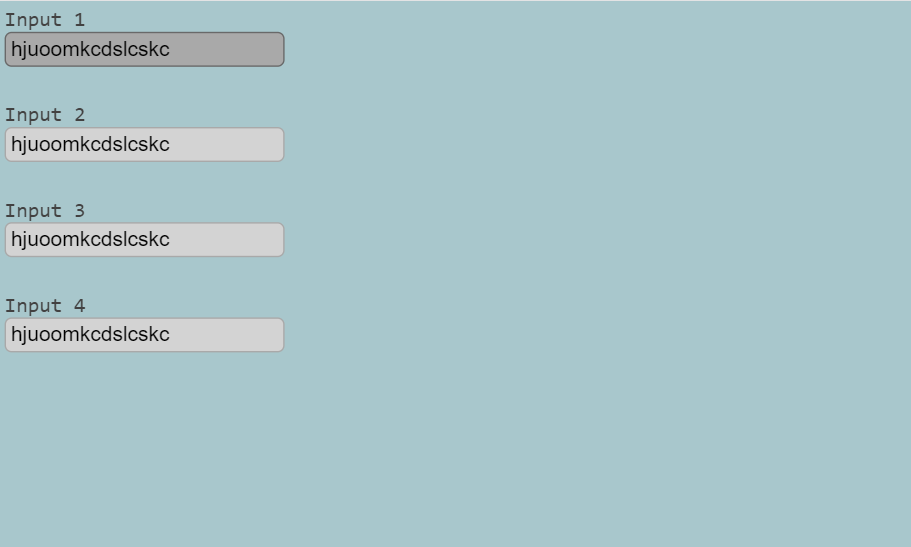

## Project Screenshots

### Notes:

This project is a simple example of Custom Event creation using Java Script.It is made using Java Script,HTML,CSS. This project will show how to sync multiple input box togather while typing.

### Output

Check here: [https://titli9830.github.io/Multi-InputBox-Sync/](https://titli9830.github.io/Multi-InputBox-Sync/) 

OR

Download & save the code in your machine. Open the html file in any browser to see the result

### Source Code Link

Check Here: [https://github.com/titli9830/Multi-InputBox-Sync](https://github.com/titli9830/Multi-InputBox-Sync)